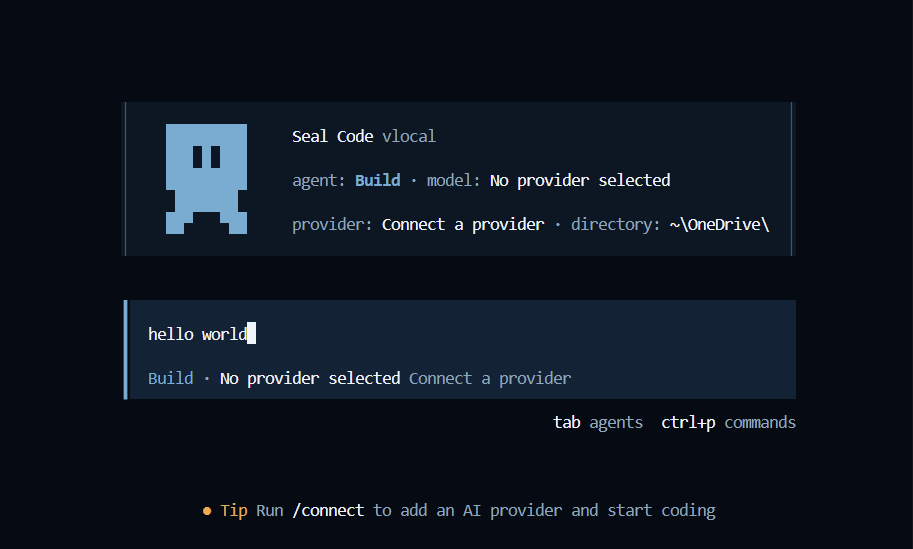

<p align="center">开源的 AI Coding Agent。</p>
<p align="center">
  <a href="https://github.com/mnmalali/sealcode/discord"></a>
  <a href="https://www.npmjs.com/package/sealcode-ai"></a>
</p>

<p align="center">
  <a href="README.md">English</a> |
  <a href="README.zh.md">简体中文</a> |
  <a href="README.zht.md">繁體中文</a> |
  <a href="README.ko.md">한국어</a> |
  <a href="README.de.md">Deutsch</a> |
  <a href="README.es.md">Español</a> |
  <a href="README.fr.md">Français</a> |
  <a href="README.it.md">Italiano</a> |
  <a href="README.da.md">Dansk</a> |
  <a href="README.ja.md">日本語</a> |
  <a href="README.pl.md">Polski</a> |
  <a href="README.ru.md">Русский</a> |
  <a href="README.bs.md">Bosanski</a> |
  <a href="README.ar.md">العربية</a> |
  <a href="README.no.md">Norsk</a> |
  <a href="README.br.md">Português (Brasil)</a> |
  <a href="README.th.md">ไทย</a> |
  <a href="README.tr.md">Türkçe</a> |
  <a href="README.uk.md">Українська</a> |
  <a href="README.bn.md">বাংলা</a> |
  <a href="README.gr.md">Ελληνικά</a> |
  <a href="README.vi.md">Tiếng Việt</a>
</p>

<p align="center">
  
</p>

---

### 安装

```bash
# 直接安装 (YOLO)
curl -fsSL https://github.com/mnmalali/sealcode/install | bash

# 软件包管理器
npm i -g sealcode-ai@latest        # 也可使用 bun/pnpm/yarn
scoop install sealcode             # Windows
choco install sealcode             # Windows
brew install mnmalali/tap/sealcode # macOS 和 Linux（推荐，始终保持最新）
brew install sealcode              # macOS 和 Linux（官方 brew formula，更新频率较低）
sudo pacman -S sealcode            # Arch Linux (Stable)
paru -S sealcode-bin               # Arch Linux (Latest from AUR)
mise use -g sealcode               # 任意系统
nix run nixpkgs#sealcode           # 或用 github:mnmalali/sealcode 获取最新 dev 分支
```

> [!TIP]
> 安装前请先移除 0.1.x 之前的旧版本。

### Terminal UI

Seal Code runs in your terminal: switch agents with `Tab`, open commands with `Ctrl+P`, and connect your provider with `/connect` before you start coding.

<p align="center">
  
</p>

#### 安装目录

安装脚本按照以下优先级决定安装路径：

1. `$SEALCODE_INSTALL_DIR` - 自定义安装目录
2. `$XDG_BIN_DIR` - 符合 XDG 基础目录规范的路径
3. `$HOME/bin` - 如果存在或可创建的用户二进制目录
4. `$HOME/.sealcode/bin` - 默认备用路径

```bash
# 示例
SEALCODE_INSTALL_DIR=/usr/local/bin curl -fsSL https://github.com/mnmalali/sealcode/install | bash
XDG_BIN_DIR=$HOME/.local/bin curl -fsSL https://github.com/mnmalali/sealcode/install | bash
```

### Agents

Seal Code 内置两种 Agent，可用 `Tab` 键快速切换：

- **build** - 默认模式，具备完整权限，适合开发工作
- **plan** - 只读模式，适合代码分析与探索
  - 默认拒绝修改文件
  - 运行 bash 命令前会询问
  - 便于探索未知代码库或规划改动

另外还包含一个 **general** 子 Agent，用于复杂搜索和多步任务，内部使用，也可在消息中输入 `@general` 调用。

了解更多 [Agents](https://github.com/mnmalali/sealcode/docs/agents) 相关信息。

### 文档

更多配置说明请查看我们的 [**官方文档**](https://github.com/mnmalali/sealcode/docs)。

### 参与贡献

如有兴趣贡献代码，请在提交 PR 前阅读 [贡献指南 (Contributing Docs)](./CONTRIBUTING.md)。

### 基于 Seal Code 进行开发

如果你在项目名中使用了 “sealcode”（如 “sealcode-dashboard” 或 “sealcode-mobile”），请在 README 里注明该项目不是 Seal Code 团队官方开发，且不存在隶属关系。

### 常见问题 (FAQ)

#### 这和 Claude Code 有什么不同？

功能上很相似，关键差异：

- 100% 开源。
- 不绑定特定提供商。推荐使用 [Seal Code Zen](https://github.com/mnmalali/sealcode/zen) 的模型，但也可搭配 Claude、OpenAI、Google 甚至本地模型。模型迭代会缩小差异、降低成本，因此保持 provider-agnostic 很重要。
- 内置 LSP 支持。
- 聚焦终端界面 (TUI)。Seal Code 由 Neovim 爱好者和 [terminal.shop](https://terminal.shop) 的创建者打造，会持续探索终端的极限。
- 客户端/服务器架构。可在本机运行，同时用移动设备远程驱动。TUI 只是众多潜在客户端之一。

---

**加入我们的社区** [飞书](https://applink.feishu.cn/client/chat/chatter/add_by_link?link_token=738j8655-cd59-4633-a30a-1124e0096789&qr_code=true) | [X.com](https://x.com/sealcode)
